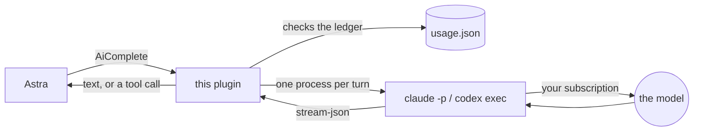
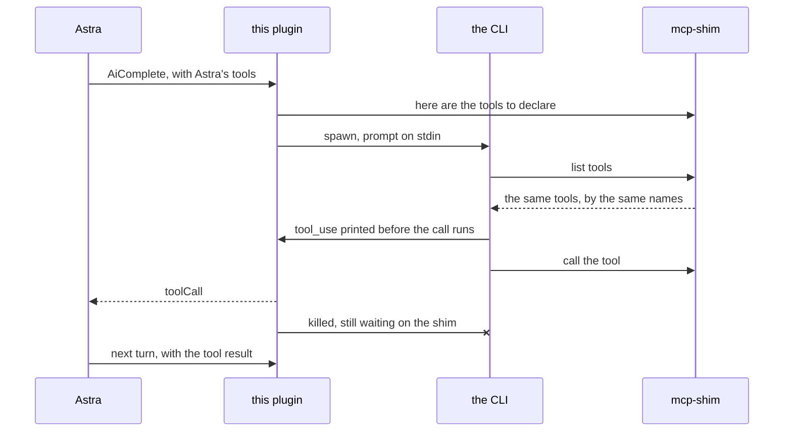

<div align="center">


# Sub Models for Astra

**Astra, running on the Claude or ChatGPT subscription you already pay for —
not on API billing.**

[](https://github.com/teletemagame-dev/sub-models-for-astra/releases)
[](LICENSE)
[](package.json)
[](#tests)
[](#how-tool-calls-work)

**English** · [Русский](README.ru.md)

</div>

---

Runs Astra on a subscription you already pay for instead of on API billing, by
driving the official agent CLI in its documented print mode.

| backend | comes with | the CLI it drives |
|---|---|---|
| **Claude Code** | Claude Pro, Max | `@anthropic-ai/claude-code` |
| **Codex CLI** | ChatGPT Plus, Pro, Team | `@openai/codex` |

Nothing here bypasses anything. Both CLIs are the vendor's own, both are
signed in by you in your own browser, and this plugin only speaks the
non-interactive mode each of them documents. It never sees a password or a
token: it spawns a binary that is already logged in.

The trade is not "free tokens". It is **money for quota** — a subscription does
not bill you, it throttles you, and it does so on a window you cannot see. So
the plugin keeps a ledger of every turn and enforces limits you set, which is
the window you can.



**Contents.**
[Install](#install) ·
[Connecting a provider](#connecting-a-provider) ·
[Settings](#settings) ·
[Why the flags look like that](#why-the-flags-look-like-that) ·
[Two CLIs](#two-clis-two-ways-to-say-the-same-thing) ·
[Starting the CLI on Windows](#starting-the-cli-on-windows) ·
[How tool calls work](#how-tool-calls-work) ·
[What is verified](#what-is-verified-and-what-is-not) ·
[When a turn fails](#when-a-turn-fails) ·
[Layout](#layout) ·
[Tests](#tests) ·
[Licence](#licence)

## Install

1. Install and sign in to the CLI you want:

   ```bash
   claude
   ```

   ```bash
   codex login
   ```

2. Install this plugin in Astra, then open its settings and pick the backend.
3. Select this plugin as the AI provider in Astra's model settings.

Every dropdown stores a readable name — *Sonnet 5*, not `sonnet`. Astra renders
a JSON Schema `enum` by printing each value with no way to attach a label, so
raw model ids are what the reader would get; the plugin translates the name
back to the id on the way to the CLI, and still accepts a raw id from anyone
who types one.

**The model list is on this plugin's settings page, not on Astra's.** Astra's
model picker cannot be filled by a plugin: the daemon builds every plugin
provider with `supports_model_discovery: false` and has no call site for
`AiGetModels` at all — measured on daemon 0.2.0, zero calls in a full day of
logs. So the boxes here are the ones that decide, one per backend, so that
switching backends cannot hand Codex a name only Claude Code understands.

Astra's own **Model** box still works as a last resort: whatever is typed there
is used when all the boxes here are empty. A value containing a slash is
ignored — that box is shaped for API model ids like `openai/gpt-4o-mini`, and
no agent CLI accepts that form.

Each backend has its own dropdown, so switching backends cannot hand one CLI a
name only another understands. **Model override** beats all of them — every
list below will go out of date, and that box is the way past it without waiting
for a plugin release.

**Claude.** Checked against a live subscription on 2026-08-19. The context and
output sizes are read off each model's own `modelUsage` report, not off a page:

| shown as | passed as | context | max output | what it is for |
|---|---|---|---|---|
| Default | — | — | — | whatever Claude Code is already set to |
| Opus 5 | `claude-opus-5` | 200K | 32K | strongest reasoning; work that has to be right rather than quick |
| Fable 5 | `fable` | 1M | 64K | the newest of the family |
| Sonnet 5 | `sonnet` | 1M | 64K | the everyday one — start here if unsure |
| Haiku 4.5 | `haiku` | 200K | 32K | fastest and cheapest; right for triggers |
| Opus 4.8 | `opus` | 1M | 64K | previous Opus; five times Opus 5's context |

Two things in that table are worth stopping on.

**Opus 5's context window is 200K — a fifth of the others', and smaller than
its own predecessor's.** This plugin re-sends the whole conversation on every
turn, so that ceiling arrives sooner here than it would in a chat app. For a
long conversation, `opus` (4.8, 1M) can be the better Opus.

**`opus` does not mean Opus 5.** The alias still resolves to
`claude-opus-4-8`, and `opus-5` is not an alias at all — the CLI answers it
with a synthetic "may not exist" turn. Aliases are otherwise preferred, because
they follow the model when Anthropic updates it; Opus is the exception, which
is why it is listed by full name.

**Codex.** GPT-5.6 Sol (`gpt-5.6-sol`, deep-reasoning flagship), GPT-5.6 Terra
(`gpt-5.6-terra`, balanced, the sensible default), GPT-5.6 Luna
(`gpt-5.6-luna`, fast and cheap, also OpenAI's subagent model), GPT-5.5
(`gpt-5.5`, previous frontier), and GPT-5.3 Codex Spark
(`gpt-5.3-codex-spark`, sub-second, text only, **ChatGPT Pro only** — it fails
outright on Plus). GPT-5.4 and 5.4-mini are deliberately absent: they retire on
31 August 2026.

**There is no Google backend, and that is deliberate.** Gemini CLI stopped
serving individual accounts on 18 June 2026 — Code Assist for individuals,
Google AI Pro and Ultra all lost it, and "Login with Google" was removed
outright. Google's replacement, the Antigravity CLI, has the same shape and
would port cleanly, but on the machine this was developed on every request came
back "not currently available in your location". Both were cut rather than
shipped as code nobody could run.

`subscription_status` reports the model in use and the alternatives, so the
question can be asked in the chat rather than in a settings page.

## Connecting a provider

Every backend needs two things done once, in a terminal: install the CLI, and
sign in to it. The plugin does neither. It used to offer both from its settings
page and that is taken back out — a settings form has no buttons, so the click
had to be inferred from a config change, the daemon delivers the config several
times at load, and the workaround was a timing guess standing between somebody
and an unrequested `npm i -g`. Four commands are better than a guess.

### First: what have you got?

Ask Astra *"what subscription CLIs are installed"* and `subscription_setup`
answers:

```
Claude Code: installed, version 2.1.211 (C:\Users\you\.local\bin\claude.exe)
Codex CLI: NOT installed — install it with: npm i -g @openai/codex
```

"Installed" and "signed in" are separate answers, because they are separate
problems and conflating them sends you to debug the wrong one. Both CLIs turn out to
have a free way to answer the second — `claude auth status` and
`codex login status` — so none of this costs quota.

The plugin runs the same check on whichever backend is selected every time it
loads and writes the result to its log, in the plainest terms it can manage:

```
Claude Code is NOT INSTALLED. Astra will fail every turn on this provider.
Install it with: npm i -g @anthropic-ai/claude-code, then sign in.

Codex CLI 0.148.0 is installed but YOU ARE NOT SIGNED IN. Astra will fail every
turn until you are. To fix it: run 'codex login' in a terminal.

Claude Code 2.1.211 found at …, signed in. Ready.
```

### Claude Code — the one that is verified end to end

Needs **Claude Pro or Max**.

```bash
npm i -g @anthropic-ai/claude-code
```

Then, in a **new** terminal window — a shell opened before the install still
has the old `PATH`:

```bash
claude
```

It asks for a theme, then how to authenticate; choose the Claude account
option, and a browser opens. When the prompt appears, you are signed in.
`/quit` leaves. To confirm it works headlessly, which is how the plugin uses
it:

```bash
claude -p "say pong"
```

In the plugin's settings: **Subscription to use** → `claude`, and pick a
**Claude model** (Sonnet 5 is the sensible start).

### Codex CLI

Needs **ChatGPT Plus, Pro or Team**.

```bash
npm i -g @openai/codex
```

```bash
codex login
```

A browser opens against your ChatGPT account; the token is cached in
`~/.codex/auth.json`. Then:

```bash
codex --version
```

In the plugin's settings: **Subscription to use** → `codex`, and pick a
**Codex model**.

### When Astra cannot find a CLI you just installed

Three things, in order of likelihood.

**Open a new terminal.** A process keeps the `PATH` it started with. A shell
opened before the install will not see the new command, and neither will
anything launched from it.

**Restart Astra** if it was running before the install — the same reason, one
level up. You can usually skip this: the plugin also looks in the npm global
prefix (`%APPDATA%\npm`) and `~/.local/bin` after `PATH` fails, precisely so a
stale daemon environment is not fatal.

**Put the full path in the settings.** Every backend has a command box, and a
full path always wins:

```
C:\Users\you\AppData\Roaming\npm\codex.cmd
```

A `.cmd` is fine — the plugin reads npm's shim and runs the script underneath
it, because Node refuses to spawn a batch file directly.

## Settings

| Setting | Default | What it does |
|---|---|---|
| Subscription to use | `claude` | Claude Code or Codex CLI |
| Claude Code command | `claude` | Full path if it is not on PATH |
| Codex command | `codex` | Full path if it is not on PATH |
| Claude model | *empty* | Dropdown — see above |
| Codex model | *empty* | Dropdown — see above |
| Model override | *empty* | Beats every dropdown |
| Thinking effort | *empty* | Empty follows what Astra asked for on the turn |
| Turns per hour | `60` | `0` turns the limit off |
| Turns per day | `400` | Rolling 24 hours, not since midnight |
| Tokens per day | `0` (off) | Counted from what the CLI reports |
| When a limit is reached | `refuse` | `refuse` fails the turn; `warn` runs it anyway |
| Turn timeout | `180 s` | Includes the CLI's cold start |
| Let the model use Astra's tools | on | Off, the model can only talk |
| Extra arguments | *empty* | Escape hatch for a flag this plugin does not know |
| Usage file | *empty* | Defaults to `~/.astra-sub-models/usage.json` |

**A turn is one request to the model, not one thing you asked for.** A question
that needs three tool calls is four turns. The numbers go further than they
look, and `subscription_status` — the one tool this plugin registers — answers
"how much is left" from inside the chat.

Limits are *yours*, not the provider's. They cannot protect a plan limit you
already spent in a terminal. What they can do is stop a runaway trigger from
eating your week before Tuesday.

## Why the flags look like that

Claude Code is an agent, and an agent's prompt is mostly its tool definitions.
Measured on 2.1.211, one `say pong` turn:

| invocation | prompt tokens | reported cost |
|---|---|---|
| `-p` with a replaced system prompt | 33 665 | $0.20 |
| …and `--strict-mcp-config` | 18 623 | $0.024 |
| …and every built-in tool disallowed | **502** | **$0.002** |

Turning the tools off is what turns the agent back into a model. The tools it
*should* see are Astra's, and those arrive over `--mcp-config`.

Two flags that look right and are not:

- **`--safe-mode`** disables MCP servers *including the one you passed*, so the
  model is handed nothing and politely explains it has no tools.
  `--strict-mcp-config` is the one that ignores every *other* config.
- **`--allowed-tools`** is a permission allowlist, not a catalogue filter.
  Naming one tool there leaves every other definition in the prompt — it
  measured 33 665 tokens, i.e. worse than doing nothing. Only
  `--disallowed-tools` removes.

## Two CLIs, two ways to say the same thing

The architecture is identical for both; only the plumbing differs.

| | Claude Code | Codex |
|---|---|---|
| headless | `-p --output-format stream-json` (needs `--verbose`) | `exec --json` |
| system prompt | `--system-prompt` | prepended to the prompt |
| our MCP server | `--mcp-config` file | `-c` overrides |
| built-ins off | `--disallowed-tools`, ~40 names | not solved |
| streaming text | yes | no, one chunk |
| reports cost | yes | no |

## Starting the CLI on Windows

Two of the three install through npm, and an npm binary on Windows is not an
executable — it is a `.cmd` shim. Node has refused to spawn `.cmd` and `.bat`
without `shell: true` since 18.20 (the fix for CVE-2024-27980), so the obvious
`spawn("gemini", …)` throws EINVAL, and dropping the extension is ENOENT.
Measured with a globally installed npm CLI: the backend could not have started
a single turn.

`shell: true` is the obvious workaround and the wrong one. These arguments
carry Astra's system prompt — arbitrary text, some of it written by whoever is
talking to Astra — and handing that to `cmd.exe` makes `&`, `|`, `^` and
`%VAR%` meaningful. A prompt is not a command line.

So `src/launcher.ts` reads the shim instead. npm writes a predictable one:

```
"%_prog%"  "%dp0%\node_modules\@google\gemini-cli\bundle\gemini.js" %*
```

The path in it is the script the shim would have run, and running that under
this same Node is the same work with none of the quoting. `gemini` resolves to
`node gemini.js`; `claude`, being a real executable, is passed through
untouched.

PATH is also not the only place it looks. A process inherits the environment it
was started with, so Astra's daemon can easily predate the install of a CLI —
which is precisely how "it works in my terminal but not in Astra" happens.
After PATH fails, the npm global prefix (`%APPDATA%\npm`) and `~/.local/bin` are
tried, both derived from the environment rather than hardcoded.

npm's own shim is a second shape again: it assigns the path to a variable with
a tilde (`SET "NPM_CLI_JS=%~dp0\node_modules\npm\bin\npm-cli.js"`) before
invoking it, so the parser matches the directory token anywhere rather than
only right after a quote, and takes the last candidate that exists — a shim's
final line is its invocation. That matters here because the plugin installs
through `npm`, so a launcher that cannot start npm cannot install anything.

One detail that cost a debugging round: npm writes *three* files per binary —
`gemini`, `gemini.cmd`, `gemini.ps1` — and the extensionless one is a shell
script for Git Bash. Preferring it, as a naive PATH walk does, resolves a
perfectly good install to a file Windows cannot execute. Executable extensions
are tried first and the bare name last.

## How tool calls work

Astra wants a `toolCall` chunk back so *it* runs the tool, with its own
permissions and its own confirmation dialog. A CLI wants to run the tool itself
and hand back prose. The two have to be pulled apart somewhere.

`src/mcp-shim.ts` is a deliberately inert MCP server. It declares Astra's tools
faithfully and then **never answers a call**. It does not need to: Claude Code
emits the `tool_use` block *before* the tool runs, so the bridge sees the call
in the output stream, reports it to Astra and kills the CLI — which is by then
waiting on a result that is never coming.

It stalls rather than returning an error because an error is something the model
reads and reacts to, and every retry-apologise-try-another-tool reaction is
tokens spent on a turn that has already ended.



Astra then executes the tool and starts a fresh turn with the result in
`messages`. That means the conversation is re-sent each time rather than
resumed — simple, and correct even when history is edited. It is also the
obvious thing to improve later.

## What is verified, and what is not

**Claude Code: measured.** `test/live-claude.mjs` drives the real CLI through
the real plugin — a prose turn, a tool call coming back named as Astra named
it, the tool result read back, and the ledger moving. It costs a few hundred
tokens of quota, which is why it is not in `npm test`.

**Codex CLI: it runs — the suite has not caught it running.** Codex CLI 0.148.0
is installed here now, and the backend has answered through Astra on a live
ChatGPT subscription (2026-08-20, reported by the author). What has not passed
is `test/live-cli.mjs codex`: the machine's ChatGPT session expired before those
four checks could run, and every request came back HTTP 401 with
`codex login status` still cheerfully answering "Logged in using ChatGPT". The
plugin named that failure correctly and in both languages, which is the one
thing that particular run did establish — see the stale-session row below.

So the flags and the event names still come from OpenAI's non-interactive docs
and the community event cheatsheet rather than from a green suite. Codex has no
partial-message events, so the reply arrives in one chunk; and it reports no
cost, so the token count is the only budget signal.

Everything version-specific lives in `parseLine` and `build` in that backend's
file, so a rename is a one-function fix.

## When a turn fails

These CLIs fail in a small number of knowable ways, and each has a different
answer. `src/diagnose.ts` recognises them and replaces the raw failure with a
sentence, in both languages:

| what the CLI said | what the user is told |
|---|---|
| `Invalid API key` | the key was rejected |
| `token could not be refreshed`, `log out and sign in` | signed in, but the session went stale — and the CLI's own status command will not admit it |
| `authentication required`, `please sign in`, `Error authenticating` | installed but nobody is signed in — run it in a terminal |
| `rate limit`, `usage limit` | the plan's own throttle, not this plugin's limits |

Stack frames are stripped on the way out. What a user actually saw before this
existed was `INTERNAL: … at throwIneligibleOrProjectIdError
(file:///C:/Users/…/chunk-LZUWGCRJ.js:310030:11) | at _doSetupUser (file:///C:/…)`
— forty frames of somebody else's bundle crowding out the one sentence that
mattered, labelled as an internal error when the cause was an account.

The stale-session row is worth its own note: `codex login status` answered
"Logged in using ChatGPT" for a token that could no longer be refreshed, so the
cheap check reported a backend as ready that failed every turn. Only running a
turn found out.

## Layout

| File | What lives there |
|---|---|
| `src/index.ts` | the plugin: limits, then the CLI, then the translation back |
| `src/config.ts` | the settings page, coerced and clamped |
| `src/budget.ts` | the ledger and the rolling windows — pure, and tested as such |
| `src/transcript.ts` | `AiCompleteRequest` → one prompt |
| `src/runner.ts` | one process, as an async iterable; `finally` kills it |
| `src/launcher.ts` | turning a command name into something Node will spawn |
| `src/diagnose.ts` | turning a CLI failure into a sentence somebody can act on |
| `src/setup.ts` | finding the CLIs and reporting what is there |
| `src/backends/claude.ts` | flags and stream-json, measured |
| `src/backends/codex.ts` | the same shape for `codex exec --json`, driven live but not yet under the live suite |
| `src/mcp-shim.ts` | the inert MCP server, built to `dist/mcp-shim.js` |

## Tests

```bash
npm test
```

66 checks, no subscription and no CLI needed: `test/fake-cli.mjs` replays lines
captured from a real run, so a field the CLI renames breaks a test rather than
production.

```bash
npm run pretest && node test/live-cli.mjs claude
```

The four that need the real thing. Takes a backend, and optionally a model:
`node test/live-cli.mjs codex "GPT-5.6 Terra"`.

## Licence

MIT. Claude and Claude Code are trademarks of Anthropic; ChatGPT and Codex are
trademarks of OpenAI. This project is not affiliated with, endorsed by, or
sponsored by either.
