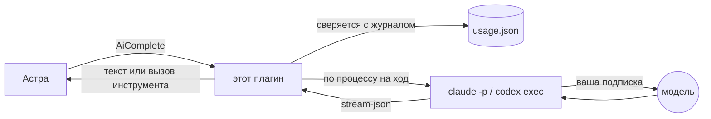
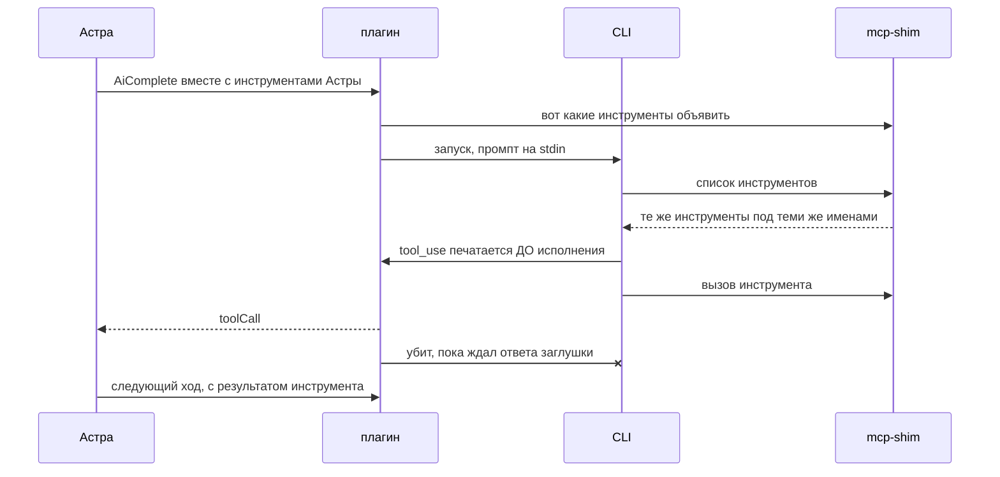

<div align="center">


# Sub Models for Astra

**Астра работает на подписке Claude или ChatGPT, за которую вы уже платите, —
а не на оплате по API.**

[](https://github.com/teletemagame-dev/sub-models-for-astra/releases)
[](LICENSE)
[](package.json)
[](#тесты)
[](#как-работают-вызовы-инструментов)

[English](README.md) · **Русский**

</div>

---

Запускает Астру на подписке, за которую вы уже платите, вместо оплаты по API —
управляя официальным agent-CLI в его задокументированном режиме печати.

| бэкенд | входит в | какой CLI он ведёт |
|---|---|---|
| **Claude Code** | Claude Pro, Max | `@anthropic-ai/claude-code` |
| **Codex CLI** | ChatGPT Plus, Pro, Team | `@openai/codex` |

Здесь ничего не обходится. Оба CLI — от самих вендоров, в оба вы входите
сами в своём браузере, и плагин говорит только на том неинтерактивном режиме,
который каждый из них документирует. Он никогда не видит ни пароля, ни токена:
он запускает бинарь, который уже залогинен.

Обмен здесь не «бесплатные токены». Это **деньги на квоту** — подписка вас не
биллит, она вас троттлит, и делает это в окне, которого вам не видно. Поэтому
плагин ведёт журнал каждого хода и держит лимиты, которые вы задали: это окно,
которое видно.



**Содержание.**
[Установка](#установка) ·
[Подключение провайдера](#подключение-провайдера) ·
[Настройки](#настройки) ·
[Почему флаги такие](#почему-флаги-выглядят-именно-так) ·
[Два CLI](#два-cli-два-способа-сказать-одно-и-то-же) ·
[Запуск на Windows](#запуск-cli-на-windows) ·
[Вызовы инструментов](#как-работают-вызовы-инструментов) ·
[Что проверено](#что-проверено-а-что-нет) ·
[Когда запрос падает](#когда-запрос-падает) ·
[Раскладка](#раскладка) ·
[Тесты](#тесты) ·
[Лицензия](#лицензия)

## Установка

1. Поставьте и авторизуйте нужный CLI:

   ```bash
   claude
   ```

   ```bash
   codex login
   ```

2. Установите плагин в Астру, откройте его настройки и выберите бэкенд.
3. Выберите плагин провайдером ИИ в настройках модели Астры.

Каждая выпадашка хранит читаемое имя — *Sonnet 5*, а не `sonnet`. Астра рисует
`enum` из JSON Schema, печатая само значение, и прицепить к нему подпись нечем, —
иначе читателю доставались бы сырые идентификаторы моделей. Плагин переводит имя
обратно в идентификатор по дороге к CLI и по-прежнему принимает сырой
идентификатор от того, кто его впишет.

**Список моделей находится на странице настроек плагина, а не Астры.** Пикер
моделей Астры плагин заполнить не может: демон строит каждого плагин-провайдера с
`supports_model_discovery: false`, и вызова `AiGetModels` у него нет вовсе —
замерено на демоне 0.2.0, ноль обращений за целые сутки логов. Так что решают
поля здесь, по одному на бэкенд, чтобы смена бэкенда не подсунула Codex имя,
понятное только Claude Code.

Собственное поле **Model** в настройках Астры всё же работает как запасной
вариант: то, что вписано туда, используется, когда все поля здесь пусты. Значение
со слэшем игнорируется — то поле рассчитано на API-идентификаторы вида
`openai/gpt-4o-mini`, а их ни один agent-CLI не принимает.

**Model override** перебивает любую выпадашку — каждый список ниже рано или
поздно устареет, и это способ обойти его, не дожидаясь нового выпуска плагина.

**Claude.** Проверено на живой подписке 19.08.2026. Размеры контекста и ответа
сняты из отчёта `modelUsage` самой модели, а не со страницы документации:

| в списке | уходит в CLI | контекст | макс. ответ | для чего |
|---|---|---|---|---|
| Default | — | — | — | то, что выставлено в самом Claude Code |
| Opus 5 | `claude-opus-5` | 200К | 32К | сильнейшие рассуждения; работа, которая должна быть правильной, а не быстрой |
| Fable 5 | `fable` | 1М | 64К | новейшая в семействе |
| Sonnet 5 | `sonnet` | 1М | 64К | повседневная — начните отсюда, если сомневаетесь |
| Haiku 4.5 | `haiku` | 200К | 32К | самая быстрая и дешёвая; хороша для триггеров |
| Opus 4.8 | `opus` | 1М | 64К | предыдущий Opus; контекст впятеро больше, чем у Opus 5 |

В этой таблице стоит остановиться на двух вещах.

**Контекст Opus 5 — 200К, пятая часть от остальных и меньше, чем у собственного
предшественника.** Плагин переотправляет весь разговор на каждом ходу, поэтому
потолок наступает здесь раньше, чем в обычном чате. Для длинной беседы `opus`
(4.8, 1М) может оказаться лучшим Opus.

**`opus` не означает Opus 5.** Алиас по-прежнему разворачивается в
`claude-opus-4-8`, а `opus-5` вообще не алиас — CLI отвечает на него
синтетическим ходом «может не существовать». В остальном алиасы предпочтительнее:
они переезжают вместе с моделью, когда Anthropic её обновляет. Opus — исключение,
поэтому он и указан полным именем.

**Codex.** GPT-5.6 Sol (`gpt-5.6-sol`, флагман глубоких рассуждений), GPT-5.6
Terra (`gpt-5.6-terra`, сбалансированная, разумный выбор по умолчанию), GPT-5.6
Luna (`gpt-5.6-luna`, быстрая и дешёвая, у OpenAI она же модель субагента),
GPT-5.5 (`gpt-5.5`, предыдущая флагманская) и GPT-5.3 Codex Spark
(`gpt-5.3-codex-spark`, задержка меньше секунды, только текст, **только ChatGPT
Pro** — на Plus просто откажет). GPT-5.4 и 5.4-mini намеренно отсутствуют: их
снимают 31 августа 2026.

**Google-бэкенда нет, и это осознанно.** Gemini CLI перестал обслуживать личные
аккаунты 18 июня 2026: Code Assist для физлиц, Google AI Pro и Ultra лишились
его разом, а вход через Google убрали совсем. Замена от Google, Antigravity CLI,
устроена так же и портировалась бы без труда, но на машине, где всё это
делалось, любой запрос возвращал «not currently available in your location».
Оба вырезаны, а не выпущены кодом, который никто не может запустить.

`subscription_status` сообщает используемую модель и альтернативы, так что этот
вопрос можно задать в чате, а не на странице настроек.

## Подключение провайдера

Каждому бэкенду нужно один раз сделать в терминале две вещи: поставить CLI и
войти в него. Плагин не делает ни того, ни другого. Раньше он предлагал и то и
другое прямо со страницы настроек — это убрано. У формы настроек нет кнопок,
поэтому клик приходилось выводить из изменения конфигурации, а демон присылает
конфигурацию при загрузке несколько раз; в итоге между человеком и незапрошенным
`npm i -g` стояла догадка о таймингах. Четыре команды лучше догадки.

### Сначала: что уже есть?

Спросите Астру *«какие CLI подписок установлены»*, и `subscription_setup`
ответит:

```
Claude Code: installed, version 2.1.211 (C:\Users\вы\.local\bin\claude.exe)
Codex CLI: NOT installed — install it with: npm i -g @openai/codex
```

«Установлен» и «авторизован» — разные ответы, потому что это разные проблемы, и
их смешение отправляет чинить не то. У обоих CLI нашёлся бесплатный способ ответить
на второй вопрос — `claude auth status` и `codex login status`, — так что квоты
это не стоит.

Ту же проверку плагин выполняет для выбранного бэкенда при каждой загрузке и
пишет результат в лог настолько прямо, насколько может:

```
Claude Code НЕ УСТАНОВЛЕН. Астра будет падать на каждом запросе с этим
провайдером. Установите: npm i -g @anthropic-ai/claude-code, затем войдите.

Codex CLI 0.148.0 установлен, но ВЫ НЕ АВТОРИЗОВАНЫ. До входа каждый запрос
будет падать. Что делать: run 'codex login' in a terminal.

Claude Code 2.1.211 найден и авторизован. Готов.
```

### Claude Code — единственный, проверенный от начала до конца

Нужна подписка **Claude Pro или Max**.

```bash
npm i -g @anthropic-ai/claude-code
```

Затем в **новом** окне терминала — окно, открытое до установки, помнит старый
`PATH`:

```bash
claude
```

Он спросит тему оформления, потом способ входа; выберите вариант с аккаунтом
Claude, откроется браузер. Появилось приглашение — вход выполнен, выйти можно
через `/quit`. Проверить, что он работает в неинтерактивном режиме — а плагин
использует именно его:

```bash
claude -p "say pong"
```

В настройках плагина: **Какую подписку использовать** → `claude`, и выберите
**Модель Claude** (разумное начало — Sonnet 5).

### Codex CLI

Нужна подписка **ChatGPT Plus, Pro или Team**.

```bash
npm i -g @openai/codex
```

```bash
codex login
```

Откроется браузер с вашим аккаунтом ChatGPT; токен кешируется в
`~/.codex/auth.json`. Затем:

```bash
codex --version
```

В настройках плагина: **Какую подписку использовать** → `codex`, и выберите
**Модель Codex**.

### Если Астра не находит только что установленный CLI

Три причины, по убыванию вероятности.

**Откройте новое окно терминала.** Процесс держит тот `PATH`, с которым
запустился. Окно, открытое до установки, новой команды не увидит — как и всё,
что из него запущено.

**Перезапустите Астру**, если она работала до установки: та же причина уровнем
выше. Обычно это можно пропустить — после неудачи по `PATH` плагин смотрит ещё
и в глобальный префикс npm (`%APPDATA%\npm`) и в `~/.local/bin`, именно чтобы
устаревшее окружение демона не было приговором.

**Впишите полный путь в настройки.** У каждого бэкенда есть поле команды, и
полный путь всегда побеждает:

```
C:\Users\вы\AppData\Roaming\npm\codex.cmd
```

`.cmd` подойдёт: плагин читает npm-шим и запускает лежащий под ним скрипт,
потому что Node отказывается запускать батник напрямую.

## Настройки

| Настройка | По умолчанию | Что делает |
|---|---|---|
| Какую подписку использовать | `claude` | Claude Code или Codex CLI |
| Команда Claude Code | `claude` | Полный путь, если его нет в PATH |
| Команда Codex | `codex` | Полный путь, если его нет в PATH |
| Модель Claude | `Default` | Выпадашка — см. выше |
| Модель Codex | `Default` | Выпадашка — см. выше |
| Модель вручную | *пусто* | Перебивает любую выпадашку |
| Глубина размышления | *пусто* | Пустое следует за тем, что запросила Астра |
| Ходов в час | `60` | `0` отключает лимит |
| Ходов в сутки | `400` | Скользящие 24 часа, а не с полуночи |
| Токенов в сутки | `0` (выкл) | Считается по отчёту CLI |
| Когда лимит достигнут | `refuse` | `refuse` роняет ход, `warn` пропускает |
| Таймаут хода | `180 с` | Включая холодный старт CLI |
| Разрешить модели инструменты Астры | вкл | Выключено — модель только разговаривает |
| Дополнительные аргументы | *пусто* | Запасной выход для неизвестного плагину флага |
| Файл учёта расхода | *пусто* | По умолчанию `~/.astra-sub-models/usage.json` |

**Ход — это один запрос к модели, а не одна ваша просьба.** Вопрос, которому
нужны три вызова инструментов, стоит четырёх ходов. Числа расходуются быстрее,
чем кажется, а `subscription_status` отвечает «сколько осталось» прямо из чата.

Лимиты — *ваши*, а не провайдера. Они не защитят лимит плана, который вы уже
потратили в терминале. Зато они не дадут разошедшемуся триггеру съесть вашу
неделю до вторника.

## Почему флаги выглядят именно так

Claude Code — это агент, а промпт агента — это в основном определения его
инструментов. Замерено на 2.1.211, один ход «скажи pong»:

| вызов | токенов промпта | заявленная цена |
|---|---|---|
| `-p` с заменённым системным промптом | 33 665 | $0.20 |
| …и `--strict-mcp-config` | 18 623 | $0.024 |
| …и все встроенные инструменты отключены | **502** | **$0.002** |

Выключение инструментов и есть то, что превращает агента обратно в модель.
Инструменты, которые он *должен* видеть, — это инструменты Астры, и приходят они
через `--mcp-config`.

Два флага, которые выглядят правильными и таковыми не являются:

- **`--safe-mode`** выключает MCP-серверы *включая переданный вами*, и модели не
  достаётся ничего — она вежливо объясняет, что инструментов нет.
  `--strict-mcp-config` — тот, который игнорирует все *остальные* конфигурации.
- **`--allowed-tools`** — это allowlist разрешений, а не фильтр каталога. Указать
  там один инструмент означает оставить в промпте все остальные определения:
  замерено 33 665 токенов, то есть хуже, чем не делать ничего. Убирает только
  `--disallowed-tools`.

## Два CLI, два способа сказать одно и то же

Архитектура одинакова для обоих, различается только обвязка.

| | Claude Code | Codex |
|---|---|---|
| headless | `-p --output-format stream-json` (нужен `--verbose`) | `exec --json` |
| системный промпт | `--system-prompt` | в начало промпта |
| наш MCP-сервер | файл `--mcp-config` | переопределения `-c` |
| выключить встроенные | `--disallowed-tools`, ~40 имён | не решено |
| потоковый текст | да | нет, одним куском |
| сообщает цену | да | нет |

## Запуск CLI на Windows

Двое из трёх ставятся через npm, а npm-бинарь на Windows — это не исполняемый
файл, а `.cmd`-шим. Node с 18.20 отказывается запускать `.cmd` и `.bat` без
`shell: true` (заплатка на CVE-2024-27980), так что очевидное
`spawn("gemini", …)` бросает EINVAL, а без расширения — ENOENT. Замерено на глобально
установленном npm-CLI: бэкенд не смог бы начать ни одного хода.

`shell: true` — очевидный обходной путь и неправильный. В аргументах едет
системный промпт Астры — произвольный текст, часть которого пишет тот, кто с ней
разговаривает, — и передача его в `cmd.exe` оживляет `&`, `|`, `^` и `%VAR%`.
Промпт — не командная строка.

Поэтому `src/launcher.ts` вместо этого читает сам шим. npm пишет предсказуемый:

```
"%_prog%"  "%dp0%\node_modules\@google\gemini-cli\bundle\gemini.js" %*
```

Путь в нём — это скрипт, который шим собирался запустить, а запуск его тем же
Node — та же работа без единой кавычки. `gemini` разворачивается в
`node gemini.js`; `claude`, будучи настоящим исполняемым файлом, проходит
нетронутым.

PATH — не единственное место, куда плагин смотрит. Процесс наследует окружение, с
которым был запущен, поэтому демон Астры вполне может быть старше установки
CLI — именно так и происходит «в терминале работает, а в Астре нет». После
неудачи по PATH проверяются глобальный префикс npm (`%APPDATA%\npm`) и
`~/.local/bin`, оба выводятся из окружения, а не захардкожены.

Собственный шим npm устроен ещё иначе: путь кладётся в переменную через тильду
(`SET "NPM_CLI_JS=%~dp0\node_modules\npm\bin\npm-cli.js"`) и только потом
вызывается. Поэтому разборщик ищет токен директории где угодно, а не сразу после
кавычки, и берёт последний существующий вариант — последняя строка шима и есть
его вызов. Это важно, потому что плагин устанавливает через `npm`: лаунчер, не
умеющий запустить npm, не сможет установить ничего.

Одна деталь, стоившая круга отладки: npm пишет **три** файла на каждый бинарь —
`gemini`, `gemini.cmd`, `gemini.ps1`, — и безрасширенный это shell-скрипт для Git
Bash. Предпочесть его, как делает наивный обход PATH, значит превратить
совершенно рабочую установку в файл, который Windows не исполняет. Исполняемые
расширения пробуются первыми, голое имя — последним.

## Как работают вызовы инструментов

Астра хочет получить чанк `toolCall`, чтобы выполнить инструмент *самой* — со
своими правами и своим диалогом подтверждения. CLI хочет выполнить его сам и
вернуть прозу. Эти двое надо где-то развести.

`src/mcp-shim.ts` — намеренно инертный MCP-сервер. Он честно объявляет
инструменты Астры и **никогда не отвечает на вызов**. Ему и не нужно: Claude Code
печатает блок `tool_use` *до* исполнения инструмента, так что мост видит вызов в
потоке вывода, сообщает о нём Астре и убивает CLI — который к тому моменту ждёт
результата, который не придёт.

Заглушка молчит, а не возвращает ошибку, потому что ошибка — это то, что модель
прочитает и на что отреагирует, а каждое «извини, попробую другой инструмент» —
это токены на уже закончившийся ход.



Дальше Астра выполняет инструмент и начинает свежий ход с результатом в
`messages`. Значит, разговор переотправляется целиком, а не возобновляется —
просто и корректно даже тогда, когда историю правили. Это же и очевидное место
для будущего улучшения.

## Что проверено, а что нет

**Claude Code: замерено.** `test/live-cli.mjs claude` прогоняет настоящий CLI
через настоящий плагин — ход прозой, вызов инструмента, вернувшийся под тем
именем, под которым его дала Астра, прочитанный обратно результат инструмента и
сдвинувшийся журнал. Это стоит нескольких сотен токенов квоты, поэтому не входит
в `npm test`.

**Codex CLI: работает — но набор проверок этого пока не застал.** Codex CLI
0.148.0 здесь уже установлен, и бэкенд отвечал через Астру на живой подписке
ChatGPT (20.08.2026, по словам автора). Чего не было — зелёного
`test/live-cli.mjs codex`: сессия ChatGPT на машине протухла раньше, чем эти
четыре проверки успели пройти, и каждый запрос возвращал HTTP 401, пока
`codex login status` бодро отвечал «Logged in using ChatGPT». Плагин назвал этот
отказ верно и на двух языках — это единственное, что тот запуск установил
достоверно; см. строку про протухшую сессию ниже.

Так что флаги и имена событий по-прежнему взяты из документации OpenAI по
неинтерактивному режиму и из community-шпаргалки, а не из зелёного набора. У
Codex нет событий частичных сообщений, поэтому ответ приходит одним куском; и он
не сообщает цену, так что счёт токенов остаётся единственным сигналом для
бюджета.

Всё, что зависит от версии, живёт в `parseLine` и `build` внутри файла
соответствующего бэкенда, так что переименование — правка на одну функцию.

## Когда запрос падает

Эти CLI ломаются небольшим числом познаваемых способов, и у каждого свой ответ.
`src/diagnose.ts` их распознаёт и заменяет сырую ошибку одним предложением, на
двух языках:

| что сказал CLI | что видит пользователь |
|---|---|
| `Invalid API key` | ключ отклонён |
| `token could not be refreshed`, `log out and sign in` | вход выполнен, но сессия протухла — а собственная проверка статуса в этом не признается |
| `authentication required`, `please sign in`, `Error authenticating` | установлен, но вход не выполнен — запустите в терминале |
| `rate limit`, `usage limit` | троттлинг самого плана, а не лимиты этого плагина |

Кадры стека по дороге отбрасываются. До этого пользователь видел
`INTERNAL: … at throwIneligibleOrProjectIdError
(file:///C:/Users/…/chunk-LZUWGCRJ.js:310030:11) | at _doSetupUser (file:///C:/…)`
— сорок кадров чужого бандла вытесняли единственное значимое предложение, и всё
это было помечено внутренней ошибкой, хотя причина была в аккаунте.

Строка про протухшую сессию стоит отдельного упоминания: `codex login status`
отвечал «Logged in using ChatGPT» для токена, который уже нельзя было обновить,
то есть дешёвая проверка объявляла готовым бэкенд, падавший на каждом запросе.
Выяснилось это только настоящим ходом.

## Раскладка

| Файл | Что там живёт |
|---|---|
| `src/index.ts` | плагин: сначала лимиты, потом CLI, потом обратный перевод |
| `src/config.ts` | страница настроек, с приведением типов и зажимом значений |
| `src/budget.ts` | журнал и скользящие окна — чистые функции, так и тестируются |
| `src/transcript.ts` | `AiCompleteRequest` → один промпт |
| `src/runner.ts` | один процесс как async-итерируемое; `finally` его убивает |
| `src/launcher.ts` | превращение имени команды в то, что Node сможет запустить |
| `src/diagnose.ts` | превращение отказа CLI в понятное предложение |
| `src/setup.ts` | поиск CLI и отчёт о том, что установлено |
| `src/backends/claude.ts` | флаги и stream-json, замерено |
| `src/backends/codex.ts` | та же форма для `codex exec --json`, вживую гонялся, но без зелёного набора |
| `src/mcp-shim.ts` | инертный MCP-сервер, собирается в `dist/mcp-shim.js` |

## Тесты

```bash
npm test
```

66 проверок, ни подписки, ни CLI не нужно: `test/fake-cli.mjs` воспроизводит
строки, снятые с настоящего запуска, так что переименованное в CLI поле ломает
тест, а не продакшен.

```bash
npm run pretest && node test/live-cli.mjs claude
```

Четыре, которым нужна настоящая подписка. Принимает бэкенд и, необязательно,
модель: `node test/live-cli.mjs codex "GPT-5.6 Terra"`.

## Лицензия

MIT. Claude и Claude Code — торговые марки Anthropic; ChatGPT и Codex — торговые
марки OpenAI. Проект не аффилирован с ними, не одобрен и не спонсируется ни
одной из компаний.
